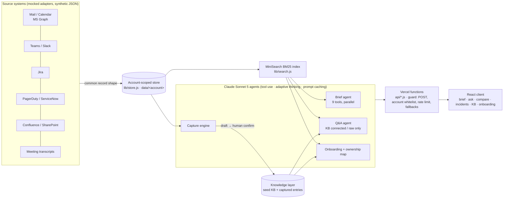

# COIH — Central Operational Intelligence Hub

**The knowledge layer that builds itself.** UST D3 2026 Hackathon · *Fix It Forward with Claude* · Category: Associate Pain Points

COIH is a per-account hub that **answers** operational questions strictly from the account's own artifacts, with a source on every claim, and **captures** new knowledge automatically from work that is already happening. Its headline feature, the return-from-leave brief, cuts a 3–5 hour manual catch-up to under a minute. Across a 5,000-person organisation that catch-up costs an estimated 120,000–200,000 hours a year.

- **Hosted demo:** _<add Vercel URL>_
- **Concept overview:** [docs/Media.jpeg](docs/Media.jpeg)
- **Integration design:** [docs/INTEGRATIONS.md](docs/INTEGRATIONS.md)
- **How we used Claude Code:** [docs/CLAUDE_CODE_USAGE.md](docs/CLAUDE_CODE_USAGE.md)

---

## 1. What the prototype demonstrates

| # | Live demo moment | Where |
|---|---|---|
| 1 | A return-from-leave brief over a two-week absence window. Every line links to its source thread, and Claude's tool calls stream live. | Priya → Return Brief |
| 2 | A grounded answer to an operational question, with clickable citations | Priya → Ask |
| 3 | Calibrated refusal: the system declines, names the gap, and suggests the person to ask | Priya → Ask "Q3 budget"; Meera → Ask before the fix |
| 4 | An incident worked end to end. Resolving it **auto-captures** a knowledge entry, and the same question is then answered by that entry, which did not exist a minute earlier. | Meera → Incidents → Ask |
| 5 | A side-by-side comparison of raw enterprise search against the self-built knowledge layer | Vikram → Ask → Compare |
| 6 | A new-joiner onboarding path plus a knowledge-ownership map of single points of failure | Vikram → Onboarding |
| 7 | Account isolation: Beta users can never retrieve Alpha records | Meera → Ask about INC-4421 |

The landing page opens with a short COIH intro, tells the story in six slides (problem, root cause, cost, what COIH does, capture, impact) and then offers a one-click sign-in as one of three personas on two isolated accounts. A **Guided demo** checklist follows the judge through each persona's flow.

## 2. Architecture



- **Adapter layer.** Every source is normalised into one record: `{sourceType, sourceId, account, timestamp, from, to, subject, body, thread, tags, component, status, …}`. Adding a source or an account is a configuration job, not a rebuild.
- **Account isolation.** Each account has its own folder and its own index, and every store call takes an explicit `account`. Knowledge entries captured in the browser are re-validated server-side (`sanitizeEntries`), so an entry can never cross accounts.
- **Agentic retrieval, not vector RAG.** Claude calls search tools (`search_sources`, `get_source`, `search_knowledge_base`, `list_people`, and time-window queries) over a BM25 index. This keeps exact IDs for citations, needs no embedding infrastructure, and lets Claude reformulate its own queries. `lib/search.js` is the single swap point for a hybrid or vector index at scale.
- **Grounded or silent.** Prompts and output contracts require a citation on every claim. When evidence is missing, the answer is `null` and the response carries a `refusal`, `gaps` and a `suggestedContact`. Confidence is calibrated as high, medium, low or none.
- **Capture loop.** Resolving an incident sends the incident, its thread, related component docs and the resolver's closing note to the capture engine. It returns a structured entry: symptom, root cause, steps, prevention, evidence, misleading hypotheses, and any older records the entry contradicts. A human confirms it in one click and it is immediately searchable.
- **Resilience.** Each Claude path can fall back to a response recorded from a real live run (`npm run record`). The UI marks these as "recorded response", so the demo never shows a blank screen.

## 3. Tech stack

| Layer | Choice |
|---|---|
| Frontend | React 18, Vite 6, React Router 7, lucide-react. Plain JSX, UST theme (Poppins, teal `#006e74`) |
| Backend | Vercel serverless functions, Node 20, ES modules (`api/`, `lib/`) |
| AI | Claude Sonnet 5 (`claude-sonnet-5`) via `@anthropic-ai/sdk`: manual tool-use loop with parallel tool execution, adaptive thinking, prompt caching, per-request token and cost accounting |
| Retrieval | MiniSearch 7 (BM25-style, prefix and fuzzy matching, field boosts) |
| Data | Synthetic JSON seed files per account; captured knowledge persisted in the browser (localStorage) |
| Hosting | Vercel (static client + functions), with `ANTHROPIC_API_KEY` as a server-side environment variable |
| Built with | Claude Code (see [docs/CLAUDE_CODE_USAGE.md](docs/CLAUDE_CODE_USAGE.md)) |

## 4. Tools and integrations

The guidelines forbid live production systems, so every integration is **mocked** with synthetic data behind the real adapter shape. The Connectors page and [docs/INTEGRATIONS.md](docs/INTEGRATIONS.md) document, for each source, the production API, the read-only scope, the sync mode and the field mapping:

- Microsoft Graph (Outlook mail, calendar, Teams channels, meeting transcripts)
- Slack
- Jira Cloud
- PagerDuty / ServiceNow (an `incident.resolved` webhook triggers capture)
- Confluence / SharePoint

## 5. Setup and run

Requirements: Node 20+ and an Anthropic API key.

```bash
git clone <repo> && cd d3-hackthon
npm run install:all            # root (SDK, MiniSearch) + client (React, Vite)
cp .env.example .env.local     # set ANTHROPIC_API_KEY=sk-ant-...
npm run dev                    # API http://localhost:3001 + web http://localhost:5173
```

Optionally, refresh the recorded fallbacks. This runs every demo path once and costs roughly $1–2:

```bash
npm run record
```

**Deploy to Vercel:**
1. Import the repository. `vercel.json` sets the build command, the output directory, 60-second functions, bundling of `data/**` and the SPA rewrites.
2. Add `ANTHROPIC_API_KEY` under Project → Settings → Environment Variables.
3. Deploy.
4. Verify with `GET /api/health`, which should return `claudeConfigured: true`.

### API

| Method | Path | Body | Returns |
|---|---|---|---|
| POST | `/api/brief` | `{accountId, personaId}` | NDJSON stream: `start`, `tool` events, then `done` with `{brief, tokenUsage, ms}` |
| POST | `/api/ask` | `{accountId, personaId, question, kbMode, capturedEntries, history}` | `{answer, confidence, sources, gaps, refusal, suggestedContact, tokenUsage}` |
| POST | `/api/capture` | `{accountId, incidentId, resolutionNote, resolvedBy}` | `{entry (draft), sourcesRead, tokenUsage}` |
| POST | `/api/onboarding` | `{accountId, personaId, capturedEntries}` | `{plan: {weeks, mustRead, knowledgeHighlights, peopleToKnow, ownershipMap, starterTask}}` |
| GET | `/api/health` | – | `{status, claudeConfigured}` |

## 6. Test datasets (all synthetic)

| Account | Client (fictional) | Records | Knowledge entries | Storyline |
|---|---|---|---|---|
| `alpha` | Helix Retail: e-commerce payments and inventory | 39 across 7 source types | 5 | Priya back from leave on Apr 1–14 2025: Stripe-over-Adyen decision, P1 INC-4421 on orders-db, a CVE patch, a reassigned rate-limiting PR, Q2 SLA review. Vikram joins on Apr 21. |
| `beta` | Meridian Freight: logistics and carrier integrations | 27 across 7 source types | 1 | Live P2 INC-7310: FastShip returning 429s after a silent v3 quota cut. The threads contain only symptoms and wrong hypotheses. Also a resolved but uncaptured INC-7244, and an outdated carrier document. |

Personas, suggested questions and checklists live in [data/accounts.json](data/accounts.json). No real client or personal data is used anywhere.

## 7. Security and data handling (prototype and production)

- **Prototype:**
  - Synthetic data only; no live systems.
  - The API key never reaches the browser.
  - Endpoints are POST-only, with an account whitelist, input-length caps, a per-IP rate limit, and a recommended spend cap on the API key.
- **Production design:**
  - One physically separate index per account, and entitlement-aware retrieval.
  - PII filtered at the adapter layer.
  - An audit log of sources and requester for every answer.
  - Approved enterprise-hosted models (e.g. Claude on Amazon Bedrock or Google Vertex AI, which is a client swap in `lib/claude.js`); no training on client data.
  - Retention aligned to the account, and human confirmation before any knowledge entry is published.

## 8. Roadmap

- Real OAuth adapters
- A server-side account index in place of localStorage
- Hybrid vector retrieval
- Brief delivery into Teams
- Guided incident triage
- Exit capture: a targeted KT plan generated from the ownership map
