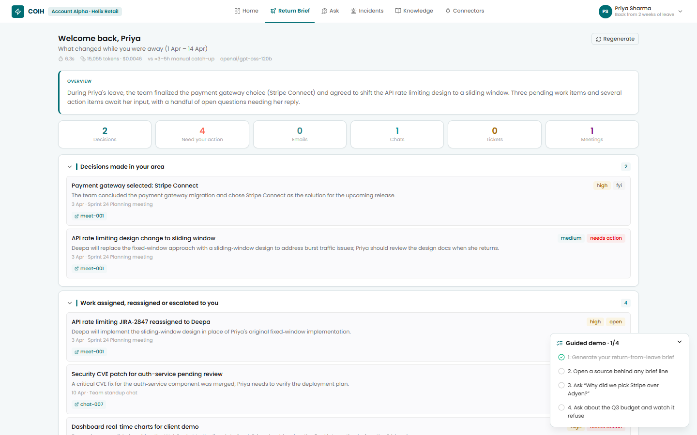
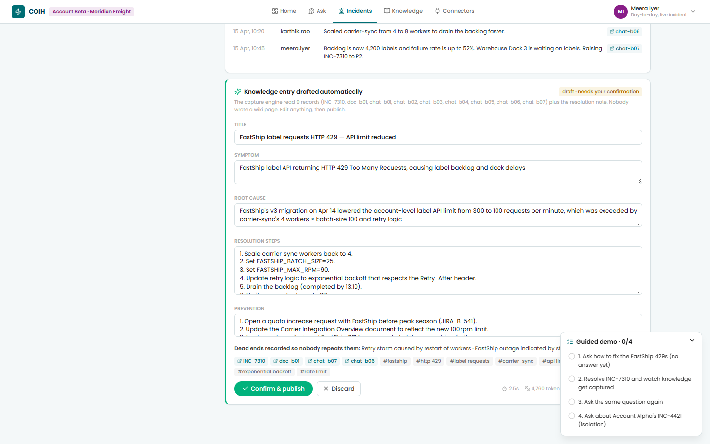
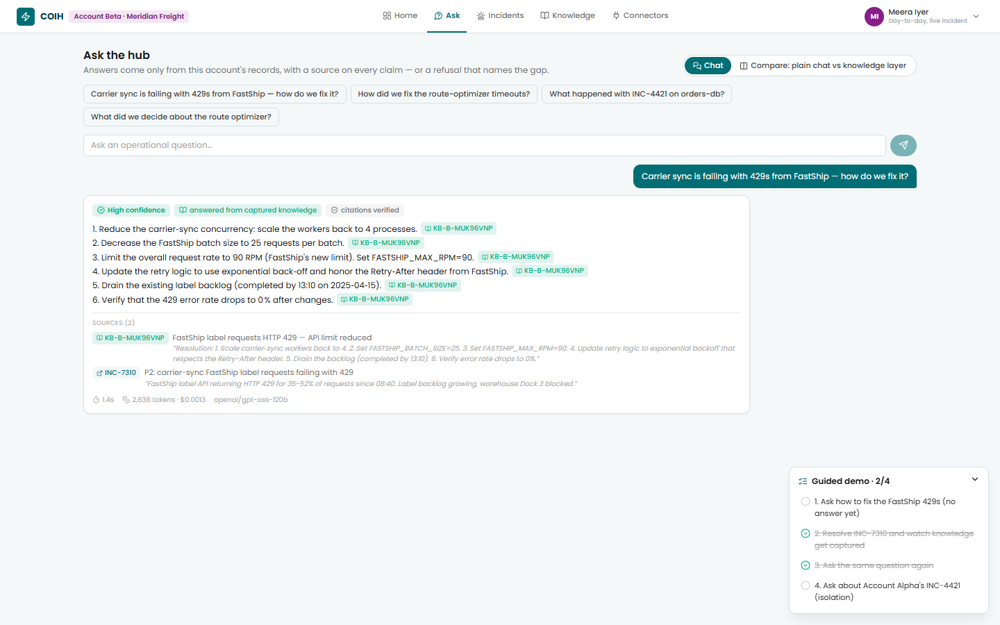
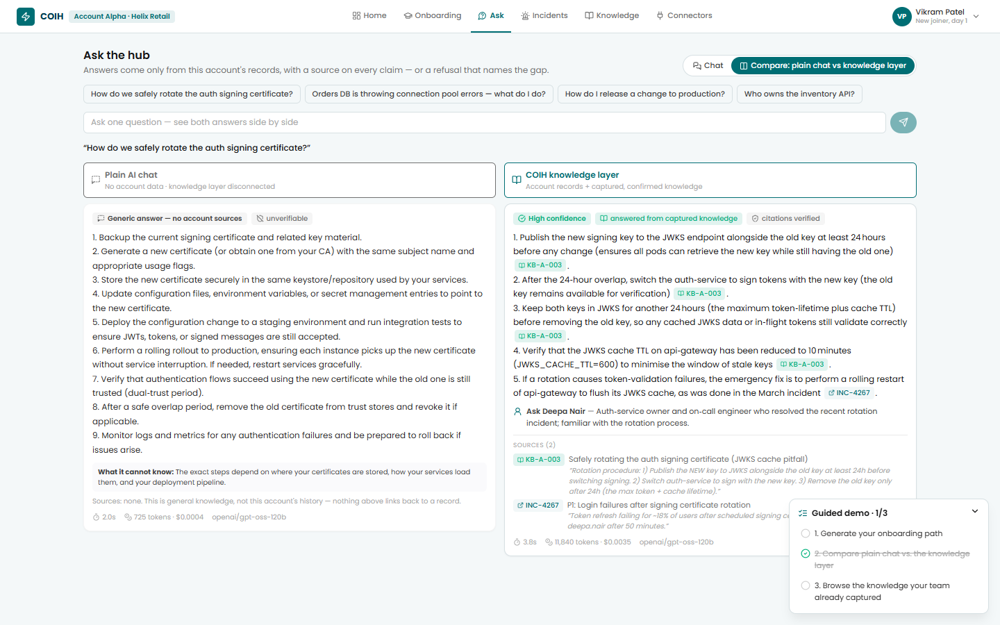
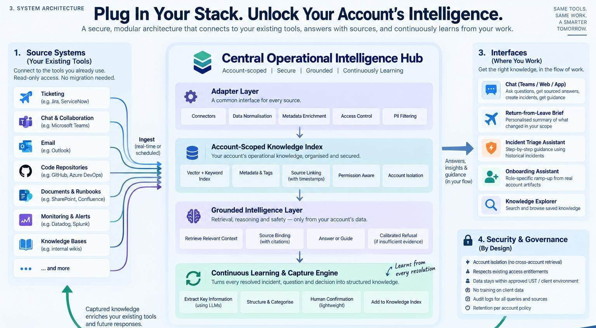

# COIH — Central Operational Intelligence Hub

## Technical Description

**UST D3 2026 Hackathon · Fix It Forward with Claude · Category: Associate Pain Points**

| | |
|---|---|
| Hosted prototype | _<add Vercel URL>_ |
| Git repository | https://github.com/AryanKulathinal/COIH_D3 |
| Team | Aryan Sajan Kulathinal · Rithin Samuel · Nizamudeen Yooncekutty |
| Runtime model | `openai/gpt-oss-120b` via OpenRouter (provider-neutral layer; Claude-ready) |
| Built with | Claude Code (35 of 40 commits co-authored) |

---

## 1. Problem statement

Every delivery account carries the same four unsolved questions, and every one of them is answered today by interrupting a human being.

| Question | How it is answered today | Cost driver |
|---|---|---|
| How does an associate catch up after two weeks of leave? | Scrolling backwards through unread mail, chat and ticket threads | 3–5 hours per leave instance |
| How does a new joiner become battle-ready? | KT calls that decay within a quarter, then 60–90 days of asking colleagues | Senior-engineer interrupt hours, delayed billability |
| How do we keep knowledge when an associate leaves? | We don't. The runbook they never wrote is the outage we take next quarter | Repeat incidents, extended handover |
| How does anyone get an answer without waiting on someone's calendar? | A Teams ping, a call, a screen share | Two people's time per question |

One root cause: the knowledge that runs an account is **tacit, scattered and individually held**. It lives in heads and threads, never in a system, because writing it down is unpaid work nobody has time for. Wikis decay, enterprise search only finds what was written down, and generic AI assistants answer confidently from general knowledge and cannot be trusted on account-specific operational questions.

## 2. ROI and impact

**Primary pain, quantified.** Leave-return catch-up costs 3–5 hours per instance. Across a 5,000-person organisation that is an estimated **120,000–200,000 productivity hours a year**. A brief that cuts catch-up to under 30 minutes recovers roughly 80% of that window. The prototype generates the brief in under a minute.

| Metric | Current | Target |
|---|---|---|
| Leave-return catch-up | 3–5 h per instance | < 30 min per instance |
| New-joiner ramp to independent resolution | 60–90 days | 30–45 days |
| Senior-engineer interrupt load | Recurring, unmeasured | Baseline, then 30–40% reduction |
| Repeat incidents with no captured resolution | Majority uncaptured | Every resolved incident captured |

**Metrics we will track:** catch-up time per leave return (primary, self-reported before/after); escalation contacts per ticket in the first 90 days; senior-engineer interrupt hours per week per account; time to first independent resolution; knowledge coverage rate (share of questions answerable with grounded sources); capture rate (share of resolved incidents that produced an entry — shown live on the Incidents page).

**Beneficiaries:** returning associates, new joiners, senior engineers and SMEs, delivery and account leadership, and clients (faster, more consistent resolution).

**Strategic value:** operational knowledge stops being a personal asset and becomes an account asset, which changes the risk profile of attrition, rotation and ramp-up on every engagement.

## 3. Solution

A per-account hub that does two things:

1. **Answers** operational questions grounded strictly in the account's own artifacts, with a source on every claim, and refuses when the evidence is missing.
2. **Captures** new knowledge automatically from work that is already happening: resolving an incident produces a structured knowledge entry with no wiki page written.

**The loop:** ask or hit an incident → grounded answer with sources, or a calibrated refusal that names the gap and the person to ask → resolve → the resolution is captured into the account knowledge base → the next person asking gets an answer instead of an escalation.

### Features in the prototype

| # | Feature | Where in the demo |
|---|---|---|
| 1 | **Return-from-leave brief** over a real two-week absence window: decisions, items assigned, threads awaiting reply, incidents in owned components, blocked items by age. Every line links to its source. Tool calls stream live. | Priya → Return Brief |
| 2 | **Grounded Q&A** with a clickable citation on every claim, server-side verified | Priya → Ask |
| 3 | **Calibrated refusal**: declines, names the gap, suggests the person to ask | Priya → "Q3 budget"; Meera → before the fix |
| 4 | **Automatic knowledge capture**: resolving an incident drafts symptom, root cause, resolution, prevention, evidence, dead-end hypotheses and contradicted documents; human confirms in one click | Meera → Incidents |
| 5 | **Knowledge that did not exist a minute ago** answers the same question that was refused before | Meera → Ask again |
| 6 | **Plain chat vs knowledge layer** side by side: the same model with and without the account's knowledge | Vikram → Ask → Compare |
| 7 | **Onboarding path + knowledge-ownership map** (single points of failure) | Vikram → Onboarding |
| 8 | **Account isolation**: a Beta user can never retrieve an Alpha record | Meera → "INC-4421" |
| 9 | **Pluggable connectors** (read-only, mocked) with production mapping documented | Connectors page |

### Demo walkthrough (live screenshots, 28 Sep 2026)









Roadmap (documented, not built): guided incident triage, exit capture, real OAuth adapters, hybrid vector retrieval, delivery of the brief into Teams.

### Design principles

- **Grounded or silent.** Every sentence carries a citation to a record retrieved in that request. The server re-verifies every citation against the retrieval log (`lib/citations.js`); unverifiable citations are removed, and an answer left with none becomes a refusal.
- **Capture is free.** Knowledge entries are derived from the closing note the engineer writes anyway.
- **Account-scoped.** One folder, one index, one explicit `account` parameter on every data call. Knowledge captured in the browser is re-validated server-side before it can be searched.
- **Pluggable by adapter.** Every source is normalised into one record shape; adding a source or a second account is configuration, not a rebuild.

## 4. Architecture



```
Source systems (mocked adapters, synthetic JSON)
  Outlook / Calendar · Teams / Slack · Jira · PagerDuty / ServiceNow · Confluence / SharePoint · Meeting transcripts
        │  common record shape {sourceType, sourceId, account, timestamp, from, to, subject, body, thread, component, …}
        ▼
Account-scoped store  lib/store.js  →  data/<account>/*.json          (isolation key: account)
        │
        ▼
MiniSearch BM25 index  lib/search.js   (swap point for hybrid / vector retrieval)
        │  exposed to the model as tools: search_sources · get_source · search_knowledge_base · list_people · query_sources · get_period_stats
        ▼
Agents  lib/agents/*  on gpt-oss-120b via OpenRouter  (lib/llm.js: tool loop, parallel tool execution, reasoning effort, JSON mode, real cost)
  Brief agent · Q&A agent (knowledge layer connected | plain-chat baseline) · Capture engine · Onboarding + ownership map
        │  every output passes citation verification  lib/citations.js
        ▼
Vercel functions  api/*.js  (lib/guard.js: POST only, account whitelist, input caps, per-IP rate limit, recorded fallbacks)
        │
        ▼
React client  client/  brief · ask · compare · incidents · knowledge · onboarding · connectors
        │
        └── Capture loop: Mark resolved → /api/capture → draft entry → human confirms → knowledge layer (browser-persisted, sent with each request)
```

### Key mechanisms

**Agentic retrieval, not vector RAG.** The model calls BM25 search tools over the account index and reformulates its own queries. This keeps exact record IDs for citations and needs no embedding infrastructure. To make retrieval deterministic, the server runs the same search on the question first and hands the model the top hits; the model then fetches full text and searches further. `lib/search.js` is the single swap point for a hybrid or vector index at scale.

**Citation verification.** `trackRetrieval` records every record ID returned by any tool during a request. `verifyAnswer` drops inline citations and sources that were not retrieved, downgrades confidence, and converts an answer with no verifiable citation into a refusal. The UI shows a "citations verified" badge with the count of removed IDs.

**Plain-chat baseline.** The compare view sends the same question twice: once to the hub, and once to the same model with no tools, no records and no knowledge base. The left column is what a generic chatbot gives an associate today; the right column is the hub.

**Capture engine.** `/api/capture` gathers the incident, its thread, related component documents and the closing note, and returns a draft entry: title, symptom, root cause, resolution steps, prevention, evidence, misleading hypotheses, tags, and any older document the entry contradicts (in the demo, a carrier guide that still states the old rate limit). The engineer edits or confirms in one click; the entry is immediately searchable.

**Return-from-leave brief.** The brief agent queries the absence window (Apr 1–14, 2025) by source type, action flags and mentions, then structures decisions, assignments, unanswered threads, incidents and blocked items with sources. Progress streams to the browser as NDJSON so the judge sees each tool call.

**Resilience.** Every model-backed path can fall back to a response recorded from a real live run (`npm run record`). The UI labels these "recorded response", so an outage never produces a blank screen and never hides that the answer was recorded.

### Live measurements (gpt-oss-120b via OpenRouter, 28 Sep 2026)

| Path | Latency | Cost per request |
|---|---|---|
| Grounded answer (Stripe vs Adyen, 3 runs) | 2.3–4.0 s | ≈ $0.003 |
| Grounded answer from a KB entry (certificate rotation) | 4.6 s | ≈ $0.005 |
| Calibrated refusal (Q3 budget, isolation check) | 7.6–8.6 s | ≈ $0.011 |
| Plain-chat baseline | 1.6 s | ≈ $0.0003 |

## 5. Tech stack

| Layer | Choice |
|---|---|
| Frontend | React 18, Vite 6, React Router 7, lucide-react. Plain JSX. UST theme (Poppins, teal `#006e74`) |
| Backend | Vercel serverless functions, Node ES modules (`api/`, `lib/`), 60 s function limit |
| AI | `openai/gpt-oss-120b` via OpenRouter's OpenAI-compatible Chat Completions API (plain `fetch`, no SDK). Hand-written tool-use loop with parallel tool execution, configurable reasoning effort, JSON mode, provider routing that requires parameter support, and real spend from `usage.cost`. Provider-neutral: switching to Claude (or Claude on Bedrock / Vertex for enterprise hosting) touches only `lib/llm.js` |
| Retrieval | MiniSearch 7 (BM25-style, prefix and fuzzy matching, field boosts) |
| Data | Synthetic JSON seed files per account; captured knowledge persisted in the browser (localStorage) and sent with each request |
| Hosting | Vercel (static client + functions). `OPENROUTER_API_KEY` is a server-side environment variable and never reaches the browser |
| Local dev | `scripts/dev-api.js` mounts the same handlers on Express (`:3001`); Vite proxies `/api` |
| Built with | Claude Code: `CLAUDE.md` project memory, six custom slash commands, plan mode, browser-driven verification, one feature per commit |

## 6. Tools and integrations used

The guidelines forbid live production systems, so every integration is **mocked** behind the real adapter shape, with synthetic data. The Connectors page and [docs/INTEGRATIONS.md](INTEGRATIONS.md) document, for each source, the production API, the read-only scope, the sync mode and the field mapping.

| Source | Production API (documented, mocked in the prototype) | Read-only scope |
|---|---|---|
| Email, calendar | Microsoft Graph messages delta, calendarView | `Mail.Read`, `Calendars.Read` |
| Chat | Graph Teams channel messages delta; Slack `conversations.history` + Events API | `ChannelMessage.Read.All`; `channels:history` |
| Tickets | Jira Cloud REST search + webhooks | `read:jira-work` |
| Incidents | PagerDuty incidents + Webhooks v3; ServiceNow table API. `incident.resolved` triggers capture | Scoped API key |
| Documents | Confluence pages v2; SharePoint drive delta | `read:confluence-content.all`; `Sites.Selected` |
| Meetings | Graph online-meeting transcripts | `OnlineMeetingTranscript.Read.All` |
| Model | OpenRouter → `openai/gpt-oss-120b` (public endpoint acceptable only because all data is synthetic) | Server-side key |

Development tooling: Claude Code, GitHub, Vercel, Node 24, npm, Vite, Express (local only), python-docx / python-pptx (this document and the deck).

## 7. Setup and run instructions

Requirements: Node 20+ (tested on Node 24) and an OpenRouter API key.

```bash
git clone https://github.com/AryanKulathinal/COIH_D3.git && cd COIH_D3
npm run install:all            # root + client dependencies
cp .env.example .env.local     # set OPENROUTER_API_KEY=sk-or-...
npm run dev                    # API http://localhost:3001 + web http://localhost:5173
```

Optional: refresh the recorded fallbacks (runs every demo path once against the live model, a few cents):

```bash
npm run record
```

Note for corporate networks with TLS inspection: the local scripts run Node with `--use-system-ca` so the Windows certificate store is trusted.

**Deploy to Vercel:** import the repository (build command, output directory, 60 s functions, bundling of `data/**` and SPA rewrites come from `vercel.json`), add `OPENROUTER_API_KEY` under Project → Settings → Environment Variables, deploy, and confirm `POST /api/health` returns `modelConfigured: true`.

**Demo script (about 5 minutes):**

1. Landing → sign in as **Priya Sharma** (Alpha). Generate the return brief; open a source behind any line. Ask "Why did we pick Stripe over Adyen?" (grounded). Ask "What is the Q3 budget for the payments team?" (refusal).
2. Switch to **Meera Iyer** (Beta). Ask how to fix the FastShip 429s (refused: incident open, no fix recorded). Incidents → Mark resolved (note prefilled) → review the auto-drafted entry → Confirm & publish → More. Ask the same question again (answered from the new entry). Ask about INC-4421 (isolation refusal).
3. Switch to **Vikram Patel** (Alpha). Ask → Compare: plain chat vs knowledge layer. Onboarding path and ownership map.

### API

| Method | Path | Body | Returns |
|---|---|---|---|
| POST | `/api/brief` | `{accountId, personaId}` | NDJSON stream: `start`, `tool` events, then `done` with `{brief, tokenUsage, ms}` |
| POST | `/api/ask` | `{accountId, personaId, question, kbMode, capturedEntries, history}` | `{answer, confidence, sources, gaps, refusal, suggestedContact, verification, grounded, tokenUsage}` |
| POST | `/api/capture` | `{accountId, incidentId, resolutionNote, resolvedBy}` | `{entry (draft), sourcesRead, tokenUsage}` |
| POST | `/api/onboarding` | `{accountId, personaId, capturedEntries}` | `{plan: {weeks, mustRead, knowledgeHighlights, peopleToKnow, ownershipMap, starterTask}}` |
| POST | `/api/health` | `{accountId}` | `{status, model, modelConfigured}` |

## 8. Test datasets (all synthetic)

No real client, personal or confidential data is used anywhere. Two fictional accounts, each with seven source types, a people directory and a seed knowledge base.

| Account | Fictional client | Records | Knowledge entries | People | Storyline |
|---|---|---|---|---|---|
| `alpha` | Helix Retail: e-commerce payments and inventory | 39 (9 emails, 9 chats, 4 tickets, 4 incidents, 6 documents, 4 meetings, 3 calendar) | 5 | 7 | Priya is back from leave (Apr 1–14, 2025): Stripe-over-Adyen decision, P1 INC-4421 on orders-db, a CVE patch, a reassigned rate-limiting PR, Q2 SLA review. Vikram joins on Apr 21. |
| `beta` | Meridian Freight: logistics and carrier integrations | 27 (5 emails, 9 chats, 4 tickets, 3 incidents, 3 documents, 1 meeting, 2 calendar) | 1 | 5 | Live P2 INC-7310: FastShip returning 429s after a silent v3 quota cut. Threads contain only symptoms and wrong hypotheses; the fix exists only in the demo's prefilled closing note. Also a resolved-but-uncaptured INC-7244 and an outdated carrier document. |

Personas, suggested questions, guided-demo checklists and the demo prefill live in `data/accounts.json`. Recorded fallbacks live in `data/<account>/fallbacks/`.

## 9. Security and data handling

**Prototype:** synthetic data only; API key server-side only (no `VITE_` prefix); endpoints POST-only with an account whitelist, input-length caps, a per-IP rate limit (40 requests per 10 minutes) and recorded fallbacks; captured entries re-validated against the requesting account before use.

**Production design (per the submission):** one physically separate index per account; entitlement-aware retrieval (the hub never shows what the associate could not already open); PII filtered at the adapter layer; approved enterprise-hosted models only (a change confined to `lib/llm.js`); no training on client data; an audit log of sources and requester for every answer; retention aligned to the account; human confirmation before any entry is published. Security review with UST Information Security precedes any pilot on live account data.

## 10. How Claude Code was used

Detailed in [docs/CLAUDE_CODE_USAGE.md](CLAUDE_CODE_USAGE.md). In brief:

- **`CLAUDE.md` project memory** gives every session the problem, architecture, folder map, run commands, demo scenario, theme tokens and rules ("grounded or silent", account-scoped access, never expose the key, one feature per commit). It was rewritten in the same session the architecture pivoted.
- **Six custom slash commands** in `.claude/commands/`: `/setup`, `/add-seed-data`, `/add-feature`, `/add-connector`, `/demo-test`, `/fix-theme`.
- **Plan mode** for the pivot from Express + MongoDB to Vercel functions + JSON seeds; Claude Code found two demo-breaking problems, asked eight design questions, and the plan was approved before code changed.
- **Skills:** the `claude-api` skill while the runtime targeted Claude; live OpenRouter docs when the team switched models for lack of an Anthropic key.
- **Verification in the running app:** Claude Code launched the servers and drove the UI in a browser (clicking through the brief, sources, questions and the capture loop), and in the final session verified fixes headlessly over the Chrome DevTools Protocol with stubbed and live model calls.
- **Attributable history:** 40 commits, 35 co-authored with Claude, one feature per commit, so `git log` reads as the build log.
- **Team tooling written by Claude Code:** the local Vercel stand-in, the fallback recorder, and the server-side citation verifier.
